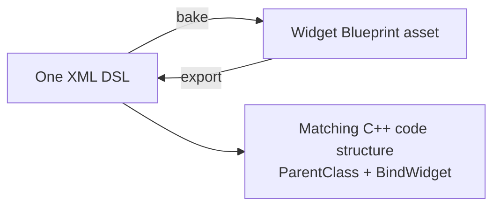
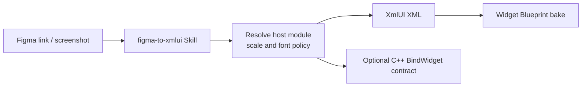

<p align="center">
  <picture>
    <source srcset="./Resources/Brand/xmlui-wordmark-dark.svg" media="(prefers-color-scheme: dark)">
    <source srcset="./Resources/Brand/xmlui-wordmark-light.svg" media="(prefers-color-scheme: light)">
    
  </picture>
</p>

<p align="center">One XML DSL generates Widget Blueprints and the corresponding C++ code structure.</p>

<p align="center">
  
  
  
  <a href="https://linux.do"></a>
</p>

<p align="center">
  <a href="./README.md">English</a> |
  <a href="./README_zh.md">简体中文</a>
</p>

---

### Overview

XmlUI is a cross-project declarative UI plugin: define your UI in one XML DSL, bake it into a Widget Blueprint asset with a single menu command in the editor, and get the matching C++ code structure (`ParentClass` + `BindWidget`). The conversion is bidirectional: bake turns the DSL into a Widget Blueprint asset, export turns it back into DSL, and every baked asset embeds the source DSL (`XmlUI.SourceDsl`) for verification and incremental updates. UI and code share one source — no manual widget layout or event wiring.



### Why XmlUI?

**Built for AI — precise and fast.** The mainstream approach makes the model drive Unreal MCP and write Python/Lua editor scripts to build UMG node by node — long pipelines, slow execution, and unstable results. XmlUI's DSL is an AI-native declarative interface: the UI is just an XML document produced in one pass, no scripts to debug, and the baked WBP is precise and predictable — generation becomes several times more efficient, letting AI genuinely power UMG development.

**One DSL, two artifacts.** The same XML defines both the WBP layout and its C++ binding structure, so UI and code always correspond and never drift apart; during development you can also preview directly from XML without waiting for a bake.

**No host-project lock-in.** The plugin source does not depend on any specific game module; module names, API macros, base classes, design resolution, fonts, and source layout are all up to the host project.

**Keeps the Unreal workflow intact.** Baked Widget Blueprints flow through the normal UMG and asset management pipeline, and C++ keeps using `BindWidget`, events, and runtime data injection — just like hand-authored UI.

**Optional Figma assistance.** The bundled Agent Skill turns Figma selections or screenshots into XmlUI skeletons and host-adapted C++ contracts.

> [!TIP]
> XmlUI depends solely on Unreal Engine modules. Once the source plugin is rebuilt inside the target project, build IDs, absolute paths, and module data from the previous host are completely gone.

### Quick Start

**1. Install the source plugin**

Copy this directory to:

```text
<TargetProject>/Plugins/XmlUI/
```

A source package should include `XmlUI.uplugin`, `Source/`, `Config/`, `Resources/`, optionally `AI/`, and the documentation.

> [!WARNING]
> Do not copy `Binaries/` or `Intermediate/` between projects. They contain host- and toolchain-specific generated data and must be rebuilt by the target project.

**2. Regenerate and compile the Editor Target**

Regenerate the project files and compile with the target project's own Unreal toolchain. If a host C++ module uses XmlUI types, add the dependency to its `.Build.cs`:

```csharp
PublicDependencyModuleNames.Add("XmlUI");
```

Use `PrivateDependencyModuleNames` when XmlUI is referenced only from `.cpp` files; use a public dependency when public headers expose XmlUI types.

**3. Write the DSL**

```xml
<XmlUI Name="RewardCard">
    <Vertical Name="ContentColumn" Padding="16,12">
        <Text Name="TitleText" Text="Gift Pack" ArtFontSize="26" Color="#FFFFFFFF" Justification="Center"/>
        <Spacer Name="SpaceTitleToBar" Size="12"/>
        <ProgressBar Name="RewardBar" Percent="0.6" FillColor="#FF00C853"/>
        <Spacer Name="SpaceBarToButton" Size="16"/>
        <Button Name="BtnClaim" Text="Claim" ButtonColor="#FF263238" TextColor="#FFFFFFFF" HAlign="Center"/>
    </Vertical>
</XmlUI>
```

**4. Bake the Widget Blueprint**

Level Editor main menu → **XmlUI** → **XmlUI: Bake DSL to Widget Blueprint**.

By default, `RewardCard.xml` bakes to `/Game/UI/WBP_RewardCard`. The baker never overwrites an existing asset, so delete the old asset or pick a different output name before rebaking.

For a quick preview during development, you can also build the UI directly at runtime via `UXmlBuilder::BuildFromString`:

```cpp
FString Error;
UWidget* Root = UXmlBuilder::BuildFromString(this, XmlContent, Error);
```

**5. Export a Widget Blueprint back to DSL**

Baked assets round-trip: Level Editor main menu → **XmlUI** → **XmlUI: Export WBP to DSL** exports a selected `.uasset` back to `.xml`.

The same operations run headless via console commands:

```text
XmlUI.ExportWbp Wbp=<asset path> Out=<output xml path>
XmlUI.BakeDsl File=<xml path>
```

`XmlUI.BakeDsl` is equivalent to the bake menu; `XmlUI.ExportWbp` writes the DSL back out.

Baked Widget Blueprint assets carry the package metadata `XmlUI.SourceDsl`, `XmlUI.SourceHash`, and `XmlUI.BakeVersion` — the original DSL text plus its MD5 — as a baseline for future incremental updates.

### DSL Reference

**Tags**

| Category | Tags | Behavior |
|---|---|---|
| Root/linear containers | `XmlUI`, `Vertical`, `Horizontal` | Build `UXmlPanel`; `XmlUI` and `Vertical` are vertical |
| Stacking container | `Overlay` | Builds `UOverlay` with child alignment and padding |
| Single-child container | `SizeBox`, `ScaleBox` | Fix/constrain desired size or scale content; only the first child is used |
| Wrapping/equal-width containers | `WrapBox`, `Grid` | Build `UWrapBox` (wrapping row) and `UUniformGridPanel` (equal-width grid) |
| Scrolling container | `ScrollBox` | Builds `UScrollBox`; `Orientation` sets the scroll direction |
| Absolute-position container | `Canvas` | Builds `UCanvasPanel`; child slots use `Position`/`Size`/`Anchors`/`Alignment`/`ZOrder`/`AutoSize` |
| Popup menu anchor | `MenuAnchor` | Builds `UMenuAnchor`; `Menu` references the popup Widget Blueprint; at most one child |
| Background border | `Border` | Builds `UBorder` with `BrushColor`/`Padding`; at most one child |
| Nested widget reference | `UserWidget` | References another Widget Blueprint via `WBP`; children with `SlotName` are inserted into the nested widget's named slots |
| Elements | `Text`, `Image`, `Button`, `CheckBox` | Text, image/color block, button, and checkbox |
| Helpers | `Spacer`, `ProgressBar` | Spacing and left-to-right progress |

**Common attributes**

| Scope | Attributes |
|---|---|
| Common | `Name`, `Class`, `Visibility`, `RenderOpacity` |
| Text | `Text`, `FontSize`, `ArtFontSize`, `FontFamily`, `Color`, `Justification`, `WrapTextAt`, `ShadowColor`, `ShadowOffset` |
| Image | `Brush`, `Color`, `DesiredSize` |
| Button | `Text`, `ButtonColor`, `TextColor`, `FontFamily`, `Padding` |
| Progress | `Percent`, `FillColor` |
| Scroll box | `Orientation` |
| Nested widget | `WBP`, `Text`, `Color`, `ArtFontSize`, `Justification` |
| Linear slots | `Padding`, `HAlign`, `VAlign`, `SizeParam` |

- Colors accept `#RRGGBB`, `#AARRGGBB`, and `(R,G,B,A)`; when alpha is involved, prefer `#AARRGGBB`.
- Resource brushes require an actual object path, e.g. `Texture2D→/Game/UI/T_Icon.T_Icon`. Until the asset is imported, use a solid-color placeholder.
- `ArtFontSize` uses the plugin's built-in Figma-size lookup; projects that do not adopt this mapping should convert sizes themselves and use `FontSize` instead.
- `FontFamily` is a generic font-family identifier resolved through the host-configured `XmlUISettings.FontFamilyMap`, whose keys are host-defined; the Figma workflow just conventionally uses Figma font family names (for example `PingFang SC`) as keys. Unmapped or unloadable names fall back to the engine default font with a warning. Map values may be the full object path (`/Game/Fonts/PingFang.PingFang`) or the shorter package path; prefer the full form for exact export round-trips.
- `Canvas`, `MenuAnchor`, and `Border` attributes are listed in the tag behavior above; the DSL Reference documents the full set.

See the [XmlUI DSL Reference](./AI/figma-to-xmlui/skills/figma-to-xmlui/references/xmlui-dsl.md) for the full behavior and edge cases.

### C++ Binding

The root node binds to a host C++ class via `ParentClass`; every `Name` in the XML maps to a `BindWidget` property in C++, and the two must correspond one-to-one.

`SampleGame` below only illustrates the path format; substitute your actual host module and class names.

```xml
<XmlUI Name="ProfileCard" ParentClass="/Script/SampleGame.ProfileCardWidget">
    <Text Name="PlayerNameText" Text="Player" FontSize="24"/>
</XmlUI>
```

The property name and type must match the DSL exactly:

```cpp
UPROPERTY(meta = (BindWidget))
UXmlTextBlock* PlayerNameText = nullptr;
```

Without `ParentClass`, the baker falls back to the configured `BaseWidgetClass`, so Blueprint-only projects can generate their UI purely from XML.

### Configuration

Plugin defaults live in `Config/DefaultXmlUI.ini`; a host project can override the same section in its own `Config/DefaultXmlUI.ini`:
> [!NOTE] Upgrading from XmlUI 0.1.0: the settings class moved to the runtime module, so the config section is now `[/Script/XmlUI.XmlUISettings]` — rename the old `[/Script/XmlUIEditor.XmlUISettings]` section in your project's `Config/DefaultXmlUI.ini`; keys and defaults are unchanged.

```ini
[/Script/XmlUI.XmlUISettings]
BaseWidgetClass=/Script/UMG.UserWidget
XmlRootPath=
BakedBlueprintOutputPath=/Game/UI
```

| Key | Purpose | Default |
|---|---|---|
| `BaseWidgetClass` | Default parent class for baked Widget Blueprints | `/Script/UMG.UserWidget` |
| `XmlRootPath` | Initial directory for the XML file picker | Empty; falls back to the project root |
| `BakedBlueprintOutputPath` | Output directory for Widget Blueprints | `/Game/UI` |
| `WidgetClassMap` | Maps DSL tags to host widget class paths | Empty |
| `FontFamilyMap` | Maps font-family names (host-defined keys; the Figma workflow conventionally uses Figma font family names) to host font asset paths | Empty |

A host project can map any DSL tag to its own widget class through `XmlUISettings.WidgetClassMap` (for example `Text` → `USampleTextBlock`); the plugin itself stays project-independent.

### AI-Assisted Workflow

`AI/figma-to-xmlui/` contains an Agent Skills-compatible Figma conversion workflow for Claude Code, OpenCode, and screenshot-based input.



Load it locally in Claude Code:

```powershell
claude --plugin-dir "Plugins/XmlUI/AI/figma-to-xmlui"
```

See the [Figma to XmlUI README](./AI/figma-to-xmlui/README.md) for detailed installation, Figma MCP, and Skill instructions.

### File Structure

```text
XmlUI/
├── AI/figma-to-xmlui/             Figma MCP + Agent Skill workflow
├── Config/DefaultXmlUI.ini        Plugin defaults
├── Resources/Brand/               Light/dark SVG wordmarks for the README
├── Source/XmlUI/                  Runtime: DSL parsing and UI widgets
├── Source/XmlUIEditor/            Editor: settings and Widget Blueprint baking
├── XmlUI.uplugin                  Plugin descriptor and module declarations
├── README.md                      English (primary)
└── README_zh.md                   Simplified Chinese
```

### Requirements

- Unreal Engine 5.5 serves as the current development and verification baseline.
- To use another engine version, recompile in the target project and verify API compatibility.
- The Figma AI workflow is optional — the core features do not depend on MCP.

<details>
<summary>Known limitations and baking notes</summary>

- There are currently no tags for input fields, sliders, list views, gradients, rounded corners, blur, or animations.
- Every baked node must have a non-empty, legal, globally unique `Name`.
- WBP → DSL export now preserves standard UMG/project widget subclasses through `Class="/Script/..."`; this makes exported trees suitable for exact-class round-trips instead of requiring `WidgetClassMap` for every host type.
- `CheckBox` is supported and round-trips its checked state.
- Keep XML generation notes inside the `<XmlUI>` root node; a comment before the root can break Unreal's XML parser.
- The root has no parent slot, so root `Padding`, `HAlign`, `VAlign`, and `SizeParam` have no effect.
- Unknown tags are skipped and unknown or malformed attributes are generally ignored, so a successful bake does not guarantee a complete layout.
- `Button`, `SizeBox`, and `ScaleBox` use at most one child; extra children are ignored.

</details>

## Acknowledgments

Thanks to the [LINUX DO](https://linux.do) community for its support and recognition, and special thanks to community member [@muchenhen](https://linux.do/u/muchenhen) for providing the original idea.
