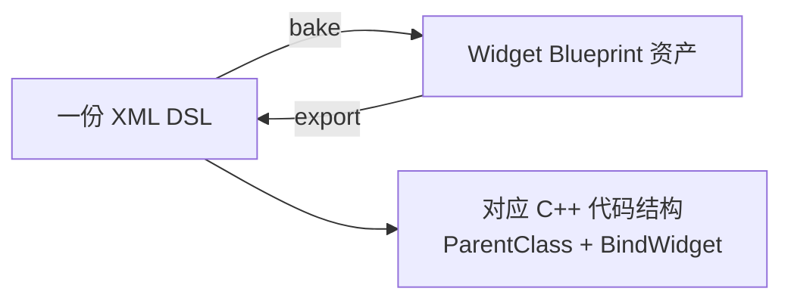
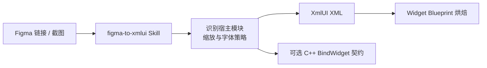

<p align="center">
  <picture>
    <source srcset="./Resources/Brand/xmlui-wordmark-dark.svg" media="(prefers-color-scheme: dark)">
    <source srcset="./Resources/Brand/xmlui-wordmark-light.svg" media="(prefers-color-scheme: light)">
    
  </picture>
</p>

<p align="center">一份 XML DSL，生成 Widget Blueprint 与对应的 C++ 代码结构。</p>

<p align="center">
  
  
  
</p>

<p align="center">
  <a href="./README.md">English</a> |
  <a href="./README_zh.md">简体中文</a>
</p>

---

### Overview

XmlUI 是一个跨项目的声明式 UI 插件：用一份 XML DSL 定义界面，在编辑器中一键烘焙出 Widget Blueprint 资产，并得到与之对应的 C++ 代码结构（`ParentClass` + `BindWidget`）。转换是双向的：烘焙（DSL→WBP）把 DSL 变成资产，导出（WBP→DSL）把资产变回 DSL，每个烘焙出的资产还内嵌源 DSL（`XmlUI.SourceDsl`）用于验证与增量更新。界面与代码同源，无需手工摆放控件或连线事件。



### Why XmlUI?

**为 AI 而生，精准而快速。** 主流方案让模型通过 Unreal MCP 编写 Python/Lua 编辑器脚本、逐节点驱动构建 UMG——链路长、执行慢、结果不稳定。XmlUI 的 DSL 是 AI-native 的声明式接口：界面即一段 XML，Agent 一次产出、无需调试脚本，烘焙出的 WBP 精确、可预期，生成效率成倍提升，让 AI 真正赋能 UMG 开发。

**一份 DSL，两种产出。** 同一份 XML 同时定义 WBP 布局与对应的 C++ 绑定结构，界面与代码始终一一对应、不会漂移；开发阶段还可直接用 XML 快速预览，无需等待烘焙。

**不绑定宿主工程。** 插件源码不依赖特定项目模块；模块名、API 宏、父类、设计分辨率、字体与源码目录，均由宿主工程自行决定。

**保留 Unreal 工作流。** WBP 进入常规的 UMG 与资产管理流程，C++ 侧继续使用 `BindWidget`、事件与运行时数据注入，与手写界面无异。

**内置 Figma 辅助链路。** 可选的 AI Skill 能将 Figma 节点或截图转换为 XmlUI 骨架，并生成适配宿主工程的 C++ 契约。

> [!TIP]
> XmlUI 仅依赖 Unreal Engine 模块。将源码插件复制到目标工程并重新编译后，原宿主的构建 ID、绝对路径与模块信息即被完全消除。

### Quick Start

**1. 安装源码插件**

将本目录复制到目标工程：

```text
<TargetProject>/Plugins/XmlUI/
```

源码分发包应包含 `XmlUI.uplugin`、`Source/`、`Config/`、`Resources/`、可选的 `AI/` 与文档。

> [!WARNING]
> 请勿跨项目复制 `Binaries/` 或 `Intermediate/`。其中包含原宿主与本机工具链生成的信息，应由目标工程重新生成。

**2. 重新生成并编译 Editor Target**

使用目标工程自身的 UE 工具链重新生成项目文件并编译。若宿主 C++ 模块使用了 XmlUI 类型，请在对应 `.Build.cs` 中添加依赖：

```csharp
PublicDependencyModuleNames.Add("XmlUI");
```

若仅在 `.cpp` 中使用 XmlUI，可改用 `PrivateDependencyModuleNames`；公开头文件暴露 XmlUI 类型时则应使用 Public 依赖。

**3. 编写 DSL**

```xml
<XmlUI Name="RewardCard">
    <Vertical Name="ContentColumn" Padding="16,12">
        <Text Name="TitleText" Text="礼包" ArtFontSize="26" Color="#FFFFFFFF" Justification="Center"/>
        <Spacer Name="SpaceTitleToBar" Size="12"/>
        <ProgressBar Name="RewardBar" Percent="0.6" FillColor="#FF00C853"/>
        <Spacer Name="SpaceBarToButton" Size="16"/>
        <Button Name="BtnClaim" Text="领取" ButtonColor="#FF263238" TextColor="#FFFFFFFF" HAlign="Center"/>
    </Vertical>
</XmlUI>
```

**4. 烘焙 Widget Blueprint**

Level Editor 主菜单 → **XmlUI** → **XmlUI: Bake DSL to Widget Blueprint**。

`RewardCard.xml` 默认烘焙为 `/Game/UI/WBP_RewardCard`。烘焙器不会覆盖同名资产；重新烘焙前请先删除旧资产或更换输出名称。

开发阶段如需快速预览，也可通过 `UXmlBuilder::BuildFromString` 在运行时直接构建界面：

```cpp
FString Error;
UWidget* Root = UXmlBuilder::BuildFromString(this, XmlContent, Error);
```

**5. 将 Widget Blueprint 导出回 DSL**

烘焙资产可往返：Level Editor 主菜单 → **XmlUI** → **XmlUI: Export WBP to DSL** 可将选中的 `.uasset` 导出回 `.xml`。

同样的操作也可通过控制台命令无头执行：

```text
XmlUI.ExportWbp Wbp=<资产路径> Out=<输出xml路径>
XmlUI.BakeDsl File=<xml路径>
```

`XmlUI.BakeDsl` 与烘焙菜单等价；`XmlUI.ExportWbp` 将 DSL 写回。

烘焙出的 Widget Blueprint 资产带有 `XmlUI.SourceDsl`、`XmlUI.SourceHash`、`XmlUI.BakeVersion` 包元数据（源 DSL 原文 + MD5），为未来的增量更新提供基线。

### DSL Reference

**标签**

| 类别 | 标签 | 行为 |
|---|---|---|
| 根/线性容器 | `XmlUI`, `Vertical`, `Horizontal` | 构建 `UXmlPanel`；`XmlUI` 与 `Vertical` 为垂直方向 |
| 叠放容器 | `Overlay` | 构建 `UOverlay`，支持子槽对齐与边距 |
| 单内容容器 | `SizeBox` | 固定或约束期望尺寸，仅使用第一个子节点 |
| 换行/等宽容器 | `WrapBox`, `Grid` | 构建 `UWrapBox`（换行行容器）与 `UUniformGridPanel`（等宽网格） |
| 滚动容器 | `ScrollBox` | 构建 `UScrollBox`，`Orientation` 设置滚动方向 |
| 绝对定位容器 | `Canvas` | 构建 `UCanvasPanel`；子槽使用 `Position`/`Size`/`Anchors`/`Alignment`/`ZOrder`/`AutoSize` |
| 弹出菜单锚点 | `MenuAnchor` | 构建 `UMenuAnchor`；`Menu` 引用弹出 Widget Blueprint；最多一个子节点 |
| 背景边框 | `Border` | 构建 `UBorder`，支持 `BrushColor`/`Padding`；最多一个子节点 |
| 嵌套控件引用 | `UserWidget` | 通过 `WBP` 引用另一个 Widget Blueprint |
| 元素 | `Text`, `Image`, `Button` | 文本、图像/色块、按钮 |
| 辅助元素 | `Spacer`, `ProgressBar` | 间距与从左到右的进度条 |

**常用属性**

| 范围 | 属性 |
|---|---|
| 通用 | `Name`, `Visibility`, `RenderOpacity` |
| 文本 | `Text`, `FontSize`, `ArtFontSize`, `Color`, `Justification`, `WrapTextAt`, `ShadowColor`, `ShadowOffset` |
| 图像 | `Brush`, `Color`, `DesiredSize` |
| 按钮 | `Text`, `ButtonColor`, `TextColor`, `Padding` |
| 进度条 | `Percent`, `FillColor` |
| 滚动容器 | `Orientation` |
| 嵌套控件 | `WBP` |
| 线性槽 | `Padding`, `HAlign`, `VAlign`, `SizeParam` |

- 颜色支持 `#RRGGBB`、`#AARRGGBB` 与 `(R,G,B,A)` 三种写法；需要透明度时建议统一使用 `#AARRGGBB`。
- Brush 资源需填写真实对象路径，例如 `Texture2D→/Game/UI/T_Icon.T_Icon`；在资产尚未导入前，可先用纯色占位。
- `ArtFontSize` 使用插件内置的 Figma 字号映射；不采用该映射的项目请自行换算，并改用 `FontSize`。
- `Canvas`、`MenuAnchor`、`Border` 的属性列在上方标签行为中；完整属性集见 DSL Reference。

完整的行为与边界说明见 [XmlUI DSL Reference（英文）](./AI/figma-to-xmlui/skills/figma-to-xmlui/references/xmlui-dsl.md)。

### C++ Binding

根节点通过 `ParentClass` 绑定宿主 C++ 类；XML 中的每个 `Name` 对应 C++ 侧的一个 `BindWidget` 属性，两者必须一一对应。

示例 `SampleGame` 仅用于演示路径格式，实际使用时须替换为宿主模块与类名。

```xml
<XmlUI Name="ProfileCard" ParentClass="/Script/SampleGame.ProfileCardWidget">
    <Text Name="PlayerNameText" Text="Player" FontSize="24"/>
</XmlUI>
```

对应属性的名称与类型必须与 DSL 完全一致：

```cpp
UPROPERTY(meta = (BindWidget))
UXmlTextBlock* PlayerNameText = nullptr;
```

未指定 `ParentClass` 时，烘焙器将使用配置中的 `BaseWidgetClass`，因此纯蓝图工程同样可以只通过 XML 生成界面。

### Configuration

插件默认配置位于 `Config/DefaultXmlUI.ini`，宿主工程可在自己的 `Config/DefaultXmlUI.ini` 中覆盖同名配置节：

```ini
[/Script/XmlUIEditor.XmlUISettings]
BaseWidgetClass=/Script/UMG.UserWidget
XmlRootPath=
BakedBlueprintOutputPath=/Game/UI
```

| Key | 用途 | 默认值 |
|---|---|---|
| `BaseWidgetClass` | 烘焙 WBP 的默认父类 | `/Script/UMG.UserWidget` |
| `XmlRootPath` | XML 文件选择器的初始目录 | 空，回退到工程根目录 |
| `BakedBlueprintOutputPath` | Widget Blueprint 输出目录 | `/Game/UI` |
| `WidgetClassMap` | 将 DSL 标签映射到宿主控件类路径 | 空 |

宿主工程可通过 `XmlUISettings.WidgetClassMap` 将任意 DSL 标签映射到自研控件类（如 `Text` → `USampleTextBlock`）；插件本身保持项目无关。

### AI-Assisted Workflow

`AI/figma-to-xmlui/` 提供了一个符合 Agent Skills 规范的 Figma 转换工作流，支持 Claude Code 与 OpenCode，并可直接接收截图输入。



在 Claude Code 中本地加载：

```powershell
claude --plugin-dir "Plugins/XmlUI/AI/figma-to-xmlui"
```

安装步骤、Figma MCP 与 Skill 的详细说明见 [Figma to XmlUI README](./AI/figma-to-xmlui/README.md)。

### File Structure

```text
XmlUI/
├── AI/figma-to-xmlui/             Figma MCP + Agent Skill 工作流
├── Config/DefaultXmlUI.ini        插件默认配置
├── Resources/Brand/               README 深浅主题 SVG wordmark
├── Source/XmlUI/                  Runtime：DSL 解析与界面控件
├── Source/XmlUIEditor/            Editor：设置与 Widget Blueprint 烘焙
├── XmlUI.uplugin                  插件描述与模块声明
├── README.md                      English（主）
└── README_zh.md                   简体中文
```

### Requirements

- Unreal Engine 5.5 为当前开发与验证基线。
- 若需接入其他引擎版本，请在目标工程中重新编译并验证 API 兼容性。
- Figma AI 工作流为可选能力；核心功能不依赖 MCP。

<details>
<summary>已知限制与烘焙注意事项</summary>

- 目前尚无输入框、滑块、列表视图、渐变、圆角、模糊或动画等标签。
- 每个烘焙节点都必须拥有非空、合法且全局唯一的 `Name`。
- XML 生成说明应写在 `<XmlUI>` 根节点内部；根节点之前的注释可能导致 Unreal XML 解析失败。
- 根节点没有父槽，因此根上的 `Padding`、`HAlign`、`VAlign`、`SizeParam` 均不生效。
- 未知标签会被跳过，未知或格式错误的属性通常被忽略；因此烘焙成功并不代表布局完整。
- `Button` 和 `SizeBox` 最多使用一个子节点，额外子节点会被忽略。

</details>
